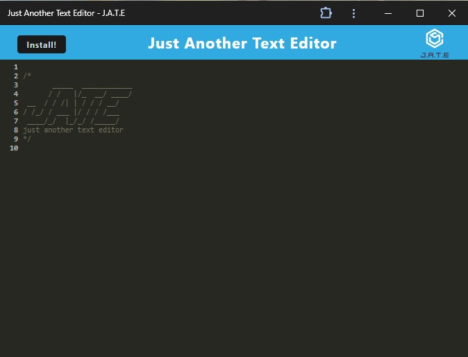
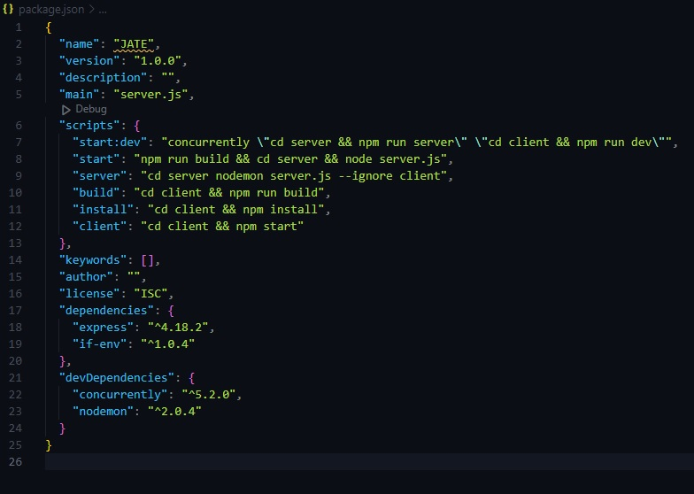

# PWA-Text-Editor

## Description

This is a single-page application developed utilizing Progressive Web Applications (PWA) to run a text editor in a browser. This application is also designed to be functional offline.

## Installation

- Clone the repository to a desired location on your computer

- Open the integrated terminal at the root of the repository and run the command `npm run install` to install the required packages.

## Usage

- Run the command `npm run start`
- Available scripts are displayed as below:

## Credits

This application was developed utilizing source code as provided by UNC Chapel Hill Coding Boot Camp.
